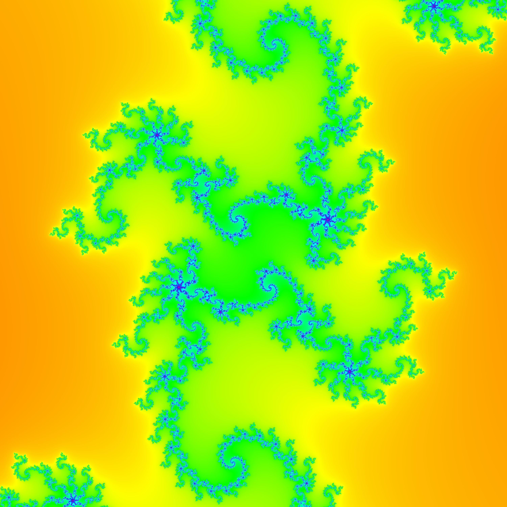

# fractals

## Usage
```console
$ fractals --help
Usage: fractals [-w WIDTH] [-h HEIGHT] [-z ZOOM] [-o OFFSET] -f FRACTAL FILE

Available options:
  -w WIDTH                 Width of the output image (default: 500)
  -h HEIGHT                Height of the output image (default: 500)
  -z ZOOM                  Strength of zoom-out from the image (default: 1.0)
  -o OFFSET                Offset of the fractal (default: 0.0)
  -f FRACTAL               Name of the fractal to draw: "Mandelbrot, Julia,
                           BurningShip"
  -h,--help                Show this help text
       
$ ./fractals -w 3000 -h 3000 -z 0.15 -f Julia f.ppm
```



## Roadmap
- Colour palettes

## License
`BSD-3-Clause`
